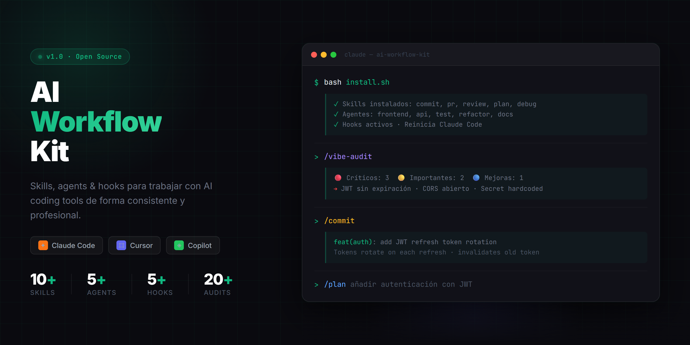

# AI Workflow Kit



Skills, agentes y hooks para trabajar con herramientas de AI coding de forma consistente y profesional.
Compatible con **Claude Code**, **Cursor**, **GitHub Copilot** y **Google Antigravity**.

## Cómo empezar en 60 segundos

```bash
# 1. Instalar
npx ai-workflow-kit

# 2. Reiniciar Claude Code (o tu herramienta de AI)

# 3. Usar tu primer skill
/ak:commit
```

Listo. Ahora tienes mensajes de commit estructurados, descripciones de PR, revisión de código, workflows de debugging y más — todo desde tu editor.

## Instalación

```bash
npx ai-workflow-kit
```

Reinicia tu herramienta de AI. Tendrás disponibles `/ak:commit`, `/ak:pr`, `/ak:plan`, `/ak:debug`, `/ak:review`, `/ak:vibe-audit`, `/ak:frontend`, `/ak:api`, `/ak:test`, `/ak:refactor`, `/ak:docs` — más 5 hooks automáticos.

```bash
npx ai-workflow-kit --skills   # solo skills y agentes
npx ai-workflow-kit --hooks    # solo hooks
npx ai-workflow-kit --yes      # sin confirmaciones
npx ai-workflow-kit --list     # ver qué se instalaría
npx ai-workflow-kit --uninstall
```

O manualmente:

```bash
cp -r skills/* ~/.claude/skills/
cp -r agents/* ~/.claude/skills/
cp -r hooks/*.sh ~/.claude/hooks/
chmod +x ~/.claude/hooks/*.sh
```

## Estructura

```
ai-workflow-kit/
├── CLAUDE.md                        # Instrucciones para Claude Code
├── GEMINI.md                        # Instrucciones para Google Antigravity
├── AGENTS.md                        # Reglas cross-tool (todas las herramientas AI)
├── .cursorrules                     # Reglas para Cursor
├── .github/
│   └── copilot-instructions.md     # Instrucciones para GitHub Copilot
├── antigravity-skills/
│   ├── commit/SKILL.md             # @commit — genera mensajes de commit semánticos
│   ├── pr/SKILL.md                 # @pr — crea PRs con descripción completa
│   ├── review/SKILL.md             # @review — revisa código con criterios reales
│   ├── plan/SKILL.md               # @plan — planifica antes de ejecutar
│   ├── debug/SKILL.md              # @debug — workflow de debugging estructurado
│   ├── vibe-audit/SKILL.md         # @vibe-audit — audita apps generadas con vibe coding
│   ├── frontend/SKILL.md           # @frontend — genera componentes de UI
│   ├── api/SKILL.md                # @api — genera endpoints con validación
│   ├── test/SKILL.md               # @test — escribe tests orientados a comportamiento
│   ├── refactor/SKILL.md           # @refactor — mejora código sin romper nada
│   └── docs/SKILL.md               # @docs — JSDoc, README, ADR
├── skills/
│   ├── commit.md                   # /ak:commit — genera mensajes de commit semánticos
│   ├── pr.md                       # /ak:pr — crea PRs con descripción completa
│   ├── review.md                   # /ak:review — revisa código con criterios reales de ingeniería
│   ├── plan.md                     # /ak:plan — planifica antes de ejecutar
│   └── debug.md                    # /ak:debug — workflow de debugging estructurado
├── agents/
│   ├── frontend.md                 # /ak:frontend — genera componentes de UI
│   ├── api.md                      # /ak:api — genera endpoints con validación
│   ├── test.md                     # /ak:test — escribe tests orientados a comportamiento
│   ├── refactor.md                 # /ak:refactor — mejora código sin romper nada
│   └── docs.md                     # /ak:docs — JSDoc, README, ADR
├── hooks/
│   ├── README.md                   # Cómo instalar y personalizar hooks
│   ├── settings.template.json      # Configuración lista para copiar
│   ├── pre-bash-safety.sh          # Bloquea comandos destructivos
│   ├── pre-commit-secrets.sh       # Detecta API keys antes de commitear
│   ├── post-write-format.sh        # Auto-formatea con Prettier/Biome
│   ├── post-edit-lint.sh           # Lintea después de cada edición
│   └── notify-done.sh              # Notificación de escritorio cuando Claude termina
└── memory/
    └── project.md                  # Memoria persistente del proyecto
```

## Skills disponibles

| Skill | Comando | Qué hace |
|-------|---------|----------|
| [commit](./antigravity-skills/commit/SKILL.md) | `/ak:commit` | Lee el diff real y genera un mensaje de commit semántico |
| [pr](./antigravity-skills/pr/SKILL.md) | `/ak:pr` | Crea PR con descripción, plan de tests y checklist |
| [review](./antigravity-skills/review/SKILL.md) | `/ak:review @file` | Revisa código: bugs, seguridad, performance |
| [plan](./antigravity-skills/plan/SKILL.md) | `/ak:plan [tarea]` | Planifica antes de ejecutar tareas complejas |
| [debug](./antigravity-skills/debug/SKILL.md) | `/ak:debug [problema]` | Diagnostica con hipótesis antes de proponer fixes |
| [vibe-audit](./antigravity-skills/vibe-audit/SKILL.md) | `/ak:vibe-audit` | Auditoría completa de apps generadas con vibe coding |

## Agentes especializados

| Agente | Comando | Qué hace |
|--------|---------|----------|
| [frontend](./agents/frontend/) | `/ak:frontend [descripción]` | Genera componentes siguiendo el design system del proyecto |
| [api](./agents/api/) | `/ak:api [descripción]` | Genera endpoints con validación, auth y manejo de errores |
| [test](./agents/test/) | `/ak:test @file` | Escribe tests por comportamiento, no por implementación |
| [refactor](./agents/refactor/) | `/ak:refactor @file` | Mejora código sin cambiar comportamiento |
| [docs](./agents/docs/) | `/ak:docs @file` | Genera JSDoc, README o ADR según se necesite |

## Ejemplos de output real

<details>
<summary><strong>/ak:commit</strong> — commit semántico desde el diff real</summary>

```
$ /ak:commit

Leyendo diff staged...

Mensaje de commit sugerido:

  feat(auth): agregar rotación de refresh token JWT

  - Genera nuevo refresh token en cada uso (previene ataques de replay)
  - El token anterior se invalida inmediatamente tras la rotación
  - Agrega expiración de 7 días y almacenamiento en cookie httpOnly

¿Continuar? [Y/n]
```

</details>

<details>
<summary><strong>/ak:plan</strong> — planificar antes de tocar código</summary>

```
$ /ak:plan agregar rate limiting a la API

## Plan: agregar rate limiting a la API

### Objetivo
Proteger todos los endpoints públicos de abuso con límites de ventana deslizante por IP.

### Archivos a modificar
- `src/middleware/rateLimiter.ts` — [nuevo] implementación de ventana deslizante
- `src/app.ts` — registrar middleware globalmente antes de los route handlers
- `src/config/limits.ts` — [nuevo] constantes de límite por ruta
- `tests/middleware/rateLimiter.test.ts` — [nuevo] tests de comportamiento

### Pasos en orden
1. Instalar `rate-limiter-flexible` (con soporte Redis, listo para producción)
2. Crear `rateLimiter.ts` con 100 req/min por defecto, 10 req/min para /auth/*
3. Montar middleware en `app.ts` antes de todas las rutas
4. Agregar tests para límite excedido (429), reset del límite y rutas exentas

### Riesgos / decisiones
- Redis requerido en prod — fallback a in-memory para desarrollo local
- Las rutas de auth usan límites más estrictos para ralentizar fuerza bruta

¿Aprobar este plan? [Y/n]
```

</details>

<details>
<summary><strong>/ak:debug</strong> — diagnóstico estructurado</summary>

```
$ /ak:debug POST /api/orders devuelve 500 solo en la segunda request

Leyendo logs de error y archivos relevantes...

## Hipótesis (ordenadas por probabilidad)

1. **Conexión a base de datos no liberada tras la primera request** (ALTA)
   - `db.connect()` llamado dentro del handler sin bloque `finally`
   - La segunda request alcanza el máximo del pool → timeout → 500
   - Verificar: `src/handlers/orders.ts:34`

2. **Estado del singleton mutado en la primera request** (MEDIA)
   - La instancia compartida `orderService` acumula estado
   - Verificar: `src/services/OrderService.ts:12`

3. **await faltante en middleware async** (BAJA)
   - Poco probable dado el patrón, pero vale descartarlo

Primer paso recomendado: agregar `finally { db.release() }` en el handler de orders.
```

</details>

<details>
<summary><strong>/ak:review</strong> — criterios reales de ingeniería</summary>

```
$ /ak:review @src/services/PaymentService.ts

Revisando src/services/PaymentService.ts...

## Problemas encontrados

### CRÍTICO
- **Línea 47**: La clave secreta de Stripe se lee desde `process.env` dentro de un loop —
  las claves rotadas usarán valores obsoletos hasta reiniciar el proceso.
  Fix: leer una vez al inicializar el módulo.

### ALTO
- **Línea 89**: `catch (e) {}` silencia todos los errores de pago.
  Fallos silenciosos significan clientes cobrados sin orden creada.

### MEDIO
- **Línea 112**: `amount` convertido con `Number()` sin validación —
  NaN se pasa silenciosamente a Stripe, que devuelve 400 (también silenciado).

### BAJO
- **Línea 23**: `async` redundante en una función que nunca usa await.
```

</details>

<details>
<summary><strong>/ak:vibe-audit</strong> — auditoría de app generada con AI</summary>

```
$ /ak:vibe-audit

Escaneando proyecto en busca de patrones de vibe coding...

## Reporte de Auditoría

### Seguridad (3 problemas)
- CRÍTICO: API keys hardcodeadas en `src/lib/openai.ts:8`
- ALTO: Sin validación en rutas de archivo enviadas por el usuario (`/api/export`)
- MEDIO: CORS configurado a `*` en `server.ts` — restringir a orígenes conocidos

### Manejo de errores (2 problemas)
- Falta error boundary en `app/dashboard/page.tsx`
- Promise rejection sin manejar en `hooks/useData.ts:34`

### Calidad de código (4 problemas)
- 3 imports no usados en 3 archivos
- Tipo `any` usado 11 veces — reemplazar con tipos reales

### Tests
- 0 archivos de test encontrados. Agrega tests antes de hacer deploy.

Corrige los 2 problemas críticos/altos antes de desplegar a producción.
```

</details>

## Hooks disponibles

Los hooks se ejecutan **automáticamente** — el dev no necesita activarlos.

| Hook | Evento | Qué hace |
|------|--------|----------|
| `pre-bash-safety` | Antes de Bash | Bloquea `rm -rf /`, force push, drop table, etc. |
| `pre-commit-secrets` | Antes de `git commit` | Escanea archivos staged buscando API keys y tokens |
| `post-write-format` | Después de Write/Edit | Formatea con Prettier o Biome automáticamente |
| `post-edit-lint` | Después de Edit | Corre ESLint y devuelve errores a Claude |
| `notify-done` | Cuando Claude termina | Notificación de escritorio (Mac/Linux/Windows) |

Ver `hooks/README.md` para instrucciones de instalación.

## Cómo usar con Claude Code

### Instalar los skills

```bash
cp skills/*.md ~/.claude/skills/
```

### Usar en cualquier proyecto

Agrega a tu `CLAUDE.md`:

```markdown
## Skills disponibles
Ver ~/.claude/skills/ para la lista completa.
Memoria del proyecto en memory/project.md.
```

### Usar con Cursor

Las reglas en `.cursorrules` se aplican automáticamente. Copia el archivo a la raíz de tu proyecto.

### Usar con GitHub Copilot

El archivo `.github/copilot-instructions.md` se usa automáticamente en repos de GitHub.

### Usar con Google Antigravity

Copia `GEMINI.md` y `AGENTS.md` a la raíz de tu proyecto. El installer copia los skills a `~/.gemini/antigravity/skills/` automáticamente.

```bash
# Copiar reglas del proyecto
cp GEMINI.md tu-proyecto/
cp AGENTS.md tu-proyecto/

# O instalar todos los skills de Antigravity globalmente
npx ai-workflow-kit --skills
```

Una vez instalados, invoca los skills con `@` en el sidebar de Antigravity:
- `@commit`, `@pr`, `@review`, `@plan`, `@debug`, `@vibe-audit`
- `@frontend`, `@api`, `@test`, `@refactor`, `@docs`

## Versionado y Changelog

Este proyecto sigue [Semantic Versioning](https://semver.org/) y [Keep a Changelog](https://keepachangelog.com/).

Ver [CHANGELOG.md](./CHANGELOG.md) para el historial completo de releases.

### Publicar una nueva versión

```bash
npm run release:patch   # 1.0.0 → 1.0.1  bug fixes
npm run release:minor   # 1.0.0 → 1.1.0  nuevos skills, agentes o hooks
npm run release:major   # 1.0.0 → 2.0.0  breaking changes
```

El script de release automáticamente:
- Lee los commits desde el último tag y los agrupa por tipo (`feat` → Added, `fix` → Fixed, `refactor` → Changed)
- Agrega la nueva entrada al inicio de `CHANGELOG.md`
- Actualiza la versión en `package.json`
- Crea un commit y un tag anotado
- Hace push de ambos al remoto

> Requiere un working tree limpio y mensajes de commit en formato Conventional Commits (`feat:`, `fix:`, `refactor:`, etc.).

## Cómo contribuir

1. Haz fork del repo
2. Agrega tu skill en `skills/nombre.md` siguiendo el patrón existente
3. Documenta el trigger, los pasos y las reglas
4. Abre un PR con `/ak:pr`

## Filosofía

- **Diagnosticar antes de actuar** — un plan aprobado vale más que código rápido
- **Skills cross-tool** — los mismos patrones funcionan en Claude Code, Cursor, Copilot y Antigravity
- **Memoria persistente** — la IA debe recordar el contexto, no pedirlo cada vez
- **Output predecible** — cada skill produce el mismo formato, siempre
