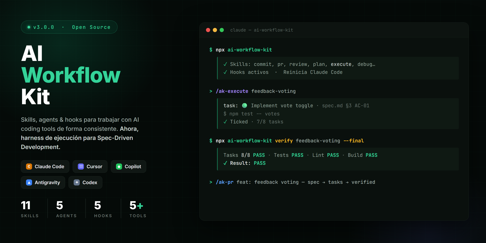

# AI Workflow Kit



Skills, agents, and hooks for working with AI coding tools consistently and professionally.
Works with **Claude Code**, **Cursor**, **GitHub Copilot**, **Google Antigravity**, and **OpenAI Codex**.

## Installation

<!-- ak:block quickstart.en -->
```bash
npx ai-workflow-kit
```

Or pin a version as a dev dependency (it's a dev tool, not a runtime dependency):

```bash
npm i -D ai-workflow-kit@2.3.0
npx ai-workflow-kit
```

Restart your AI tool. You'll have `/ak:api`, `/ak:commit`, `/ak:debug`, `/ak:docs`, `/ak:execute`, `/ak:frontend`, `/ak:handoff`, `/ak:help`, `/ak:memory`, `/ak:plan`, `/ak:pr`, `/ak:refactor`, `/ak:review`, `/ak:setup`, `/ak:test`, `/ak:vibe-audit` available — plus 5 automatic hooks.

```bash
npx ai-workflow-kit --global   # install into ~/.claude/ — all projects (default)
npx ai-workflow-kit --local    # install into .claude/ — this project only
npx ai-workflow-kit --skills   # skills and agents only
npx ai-workflow-kit --hooks    # hooks only
npx ai-workflow-kit --yes      # no confirmations
npx ai-workflow-kit --list     # see what would be installed
npx ai-workflow-kit --uninstall
```
<!-- /ak:block -->

## Running a plan

`/ak:plan` writes `specs/<slug>/plan.md` with a checkbox per step, each carrying
the command that proves it done. The `verify` subcommand runs those commands and
ticks a box only when its command exits 0, so what the file records is what was
demonstrated rather than what was claimed:

```bash
npx ai-workflow-kit verify <slug>            # run the next unchecked step
npx ai-workflow-kit verify <slug> --all      # keep going until one fails
npx ai-workflow-kit verify <slug> --recheck  # re-run ticked steps, catch regressions
npx ai-workflow-kit verify <slug> --dry-run  # print the commands, run nothing
```

With no slug it picks the only plan that has work left, and refuses to guess if
several do. It prompts before each command unless you pass `--yes`.

> The commands come from a markdown file in your working tree. A `specs/`
> directory from a repo you don't trust can run anything your shell can — read
> a plan before verifying it, the same as any script.

### Running an SDD feature

The same engine drives Spec-Driven Development. When a spec tool (such as
sdd-creator) has generated `specs/<slug>/spec.md` + `plan.md` + `tasks.md`,
`verify` prefers `tasks.md` — the SDD execution artifact — and the division of
labor is: the SDD tool owns Understand → Spec → Plan → Tasks; this kit runs
Task → Verify → Fix → Review → Final Verify → PR.

```bash
npx ai-workflow-kit verify <slug>            # next unchecked task in tasks.md
npx ai-workflow-kit verify <slug> --final    # every task's Verify + the global checks from .ak/config.md
npx ai-workflow-kit verify <slug> --plan     # force plan.md when both files exist
```

A task is machine-checkable when it carries the same grammar plan steps use —
one line, backticks required:

```markdown
- [ ] 🟢 **Implement vote toggle** — files: `src/votes/service.ts`. Criterion: `spec.md §3.2 AC-03`.
      Verify: `npm test -- votes`
```

Tasks without a `Verify:` line are reported as unverifiable and never ticked.
`--final` is read-only: it re-runs every task's Verify (catching regressions in
ticked tasks), then the `Test` / `Lint` / `Typecheck` / `Build` / `E2E`
commands recorded under `## Commands` in `.ak/config.md`, and prints a summary
that ends in `Result: PASS` or `FAIL`. The `/ak:execute` skill drives this loop
one task at a time.

Or manually:

```bash
cp -r skills/* ~/.claude/skills/
cp -r agents/* ~/.claude/skills/
cp -r hooks/*.sh ~/.claude/hooks/
chmod +x ~/.claude/hooks/*.sh
```

## Structure

```
ai-workflow-kit/
├── CLAUDE.md                        # Instructions for Claude Code
├── GEMINI.md                        # Instructions for Google Antigravity
├── AGENTS.md                        # Cross-tool rules (all AI tools)
├── .cursorrules                     # Rules for Cursor
├── .github/
│   └── copilot-instructions.md     # Instructions for GitHub Copilot
├── antigravity-skills/
│   ├── help/SKILL.md               # @help — routes a task to the skill that fits
│   ├── setup/SKILL.md              # @setup — records repo conventions in .ak/config.md
│   ├── commit/SKILL.md             # @commit — generates semantic commit messages
│   ├── pr/SKILL.md                 # @pr — creates PRs with full description
│   ├── review/SKILL.md             # @review — reviews code with real criteria
│   ├── plan/SKILL.md               # @plan — plans before executing
│   ├── execute/SKILL.md            # @execute — works an SDD task list with proof
│   ├── debug/SKILL.md              # @debug — structured debugging workflow
│   ├── vibe-audit/SKILL.md         # @vibe-audit — audits vibe-coded apps
│   ├── frontend/SKILL.md           # @frontend — generates UI components
│   ├── api/SKILL.md                # @api — generates endpoints with validation
│   ├── test/SKILL.md               # @test — writes behavior-driven tests
│   ├── refactor/SKILL.md           # @refactor — improves code without breaking anything
│   └── docs/SKILL.md               # @docs — JSDoc, README, ADR
├── codex-prompts/
│   ├── ak-help.md                  # /ak-help — routes a task to the skill that fits
│   ├── ak-setup.md                 # /ak-setup — records repo conventions in .ak/config.md
│   ├── ak-commit.md                # /ak-commit — generates semantic commit messages
│   ├── ak-pr.md                    # /ak-pr — creates PRs with full description
│   ├── ak-review.md                # /ak-review — reviews code with real engineering criteria
│   ├── ak-plan.md                  # /ak-plan — plans before executing
│   ├── ak-execute.md               # /ak-execute — works an SDD task list with proof
│   ├── ak-debug.md                 # /ak-debug — structured debugging workflow
│   ├── ak-vibe-audit.md            # /ak-vibe-audit — audits vibe-coded apps
│   ├── ak-handoff.md               # /ak-handoff — compacts the session for a fresh agent
│   └── ak-memory.md                # /ak-memory — save / recall / clean project memory
├── skills/
│   ├── help/SKILL.md               # /ak:help — routes a task to the skill that fits
│   ├── setup/SKILL.md              # /ak:setup — records repo conventions in .ak/config.md
│   ├── commit/SKILL.md             # /ak:commit — generates semantic commit messages
│   ├── pr/SKILL.md                 # /ak:pr — creates PRs with full description
│   ├── review/SKILL.md             # /ak:review — reviews code with real engineering criteria
│   ├── plan/SKILL.md               # /ak:plan — plans before executing
│   ├── execute/SKILL.md            # /ak:execute — works an SDD task list with proof
│   ├── debug/SKILL.md              # /ak:debug — structured debugging workflow
│   ├── vibe-audit/SKILL.md         # /ak:vibe-audit — audits vibe-coded apps
│   ├── handoff/SKILL.md            # /ak:handoff — compacts the session for a fresh agent
│   └── memory/SKILL.md             # /ak:memory — save / recall / clean project memory
├── agents/
│   ├── frontend/AGENT.md           # /ak:frontend — generates UI components
│   ├── api/AGENT.md                # /ak:api — generates endpoints with validation
│   ├── test/AGENT.md               # /ak:test — writes behavior-driven tests
│   ├── refactor/AGENT.md           # /ak:refactor — improves code without breaking anything
│   └── docs/AGENT.md               # /ak:docs — JSDoc, README, ADR
├── hooks/
│   ├── README.md                   # How to install and customize hooks
│   ├── settings.template.json      # Ready-to-copy configuration
│   ├── pre-bash-safety.sh          # Blocks destructive commands
│   ├── pre-commit-secrets.sh       # Detects API keys before committing
│   ├── post-write-format.sh        # Auto-formats with Prettier/Biome
│   ├── post-edit-lint.sh           # Lints after each edit
│   └── notify-done.sh              # Desktop notification when Claude finishes
└── memory/
    └── project.md                  # Persistent project memory
```

## Available Skills

One page per skill in [`docs/skills/`](docs/skills/README.md) — what it does, when to reach for it, and how to tell it's working.

<!-- ak:skill-table -->

| Skill | Command | What it does |
|-------|---------|--------------|
| help | `/ak:help [task]` | Points at the one skill that fits what you're doing |
| setup | `/ak:setup` | Records this repo's branch, commands, and conventions in `.ak/config.md` |
| commit | `/ak:commit` | Reads the real diff and generates a semantic commit message |
| pr | `/ak:pr` | Creates PR with description, test plan, and checklist |
| review | `/ak:review @file` | Reviews code: bugs, security, performance |
| plan | `/ak:plan [task]` | Plans before executing, into a resumable `specs/<slug>/plan.md` |
| execute | `/ak:execute [slug]` | Executes the next pending SDD task and lets `verify` prove it |
| debug | `/ak:debug [problem]` | Diagnoses with hypotheses before proposing fixes |
| vibe-audit | `/ak:vibe-audit` | Full audit of apps generated with vibe coding |
| handoff | `/ak:handoff [focus]` | Compacts the session into a handoff for a fresh agent |
| memory | `/ak:memory <save\|recall\|clean>` | Persists, retrieves, and prunes what the project has learned |

## Specialized Agents

| Agent | Command | What it does |
|-------|---------|--------------|
| frontend | `/ak:frontend [description]` | Generates components following the project's design system |
| api | `/ak:api [description]` | Generates endpoints with validation, auth, and error handling |
| test | `/ak:test @file` | Writes tests by behavior, not by implementation |
| refactor | `/ak:refactor @file` | Improves code without changing behavior |
| docs | `/ak:docs @file` | Generates JSDoc, README, or ADR as needed |

## Available Hooks

Hooks run **automatically** — no activation needed from the dev.

| Hook | Event | What it does |
|------|-------|--------------|
| `pre-bash-safety` | Before Bash | Blocks `rm -rf /`, force push, drop table, etc. |
| `pre-commit-secrets` | Before `git commit` | Scans staged files for API keys and tokens |
| `post-write-format` | After Write/Edit | Formats with Prettier or Biome automatically |
| `post-edit-lint` | After Edit | Runs ESLint and returns errors to Claude |
| `notify-done` | When Claude finishes | Desktop notification (Mac/Linux/Windows) |

See `hooks/README.md` for installation instructions.

## How to Use with Claude Code

### Install the skills

```bash
# Copy skills to Claude Code
cp skills/*.md ~/.claude/skills/
```

### Use in any project

Add to your project's `CLAUDE.md`:

```markdown
## Available Skills
See ~/.claude/skills/ for the full list.
Project memory at memory/project.md.
```

### Use with Cursor

The rules in `.cursorrules` apply automatically. Copy the file to your project root.

### Use with GitHub Copilot

The `.github/copilot-instructions.md` file is used automatically in GitHub repos.

### Use with Google Antigravity

```bash
npx ai-workflow-kit --antigravity            # asks global or project
npx ai-workflow-kit --antigravity --global   # ~/.gemini/config/skills/
npx ai-workflow-kit --antigravity --local    # .agents/skills/ in this project
```

Antigravity discovers skills from a `skills/` folder inside a **customization root**, in this precedence order:

| Priority | Location | Scope |
|----------|----------|-------|
| 1 | `.agents/skills/` at the project root | this project (commit it to share with the team) |
| 2 | Paths declared in `.agents/skills.json` | wherever you point it |
| 3 | `~/.gemini/config/skills/` | all projects on your machine |
| 4 | Built-in skills | bundled with the app |

Rules are separate and hierarchical — `GEMINI.md`, `AGENTS.md`, and `.agents/rules/*.md`, loaded by walking up from the file you're editing to the repo root. The installer drops `GEMINI.md` and `AGENTS.md` in the project root for you.

> **Path change:** older versions used `~/.gemini/antigravity/skills/`. Antigravity migrated the global root to `~/.gemini/config/`, leaving a compatibility symlink behind on machines that upgraded in place. Fresh installs don't read the old path, so the kit now writes to `~/.gemini/config/skills/`. If you installed an earlier version of the kit, run `npx ai-workflow-kit --antigravity --uninstall` — it cleans up both paths.

Once installed, invoke skills with `@` in the Antigravity sidebar:
- `@commit`, `@pr`, `@review`, `@plan`, `@execute`, `@debug`, `@vibe-audit`
- `@frontend`, `@api`, `@test`, `@refactor`, `@docs`

### Use with OpenAI Codex

Codex reads two things: `AGENTS.md` in your project root for the rules, and `~/.codex/prompts/*.md` for slash commands. The installer handles both:

```bash
npx ai-workflow-kit --codex
```

It copies `codex-prompts/*.md` to `~/.codex/prompts/` (or `$CODEX_HOME/prompts/` if set) and drops `AGENTS.md` in the current project. Restart Codex and you'll have:

- `/ak-commit`, `/ak-pr`, `/ak-review`, `/ak-plan`, `/ak-execute`, `/ak-debug`
- `/ak-vibe-audit`, `/ak-handoff`, `/ak-memory`

Codex uses `-` instead of `:` in command names, so it's `/ak-commit`, not `/ak:commit`.

The specialized agents (`/ak:frontend`, `/ak:api`, `/ak:test`, `/ak:refactor`, `/ak:docs`) are **not** ported — they rely on Claude Code subagents, which Codex has no equivalent for.

To remove them:

```bash
npx ai-workflow-kit --codex --uninstall
```

## Versioning & Changelog

This project follows [Semantic Versioning](https://semver.org/) and [Keep a Changelog](https://keepachangelog.com/).

See [CHANGELOG.md](./CHANGELOG.md) for the full release history.

### Releasing a new version

```bash
npm run release:patch   # 1.0.0 → 1.0.1  bug fixes
npm run release:minor   # 1.0.0 → 1.1.0  new skills, agents, or hooks
npm run release:major   # 1.0.0 → 2.0.0  breaking changes
```

The release script automatically:
- Reads commits since the last tag and groups them by type (`feat` → Added, `fix` → Fixed, `refactor` → Changed)
- Prepends the new entry to `CHANGELOG.md`
- Bumps `package.json` version
- Creates a single commit and an annotated git tag
- Pushes both to the remote

> Requires a clean working tree and conventional commit messages (`feat:`, `fix:`, `refactor:`, etc.).

## How to Contribute

1. Fork the repo
2. Add your skill in `skills/name.md` following the existing pattern
3. Document the trigger, steps, and rules
4. Open a PR with `/ak:pr`

## Philosophy

- **Diagnose before acting** — an approved plan is worth more than fast code
- **Cross-tool skills** — the same patterns work in Claude Code, Cursor, Copilot, Antigravity, and Codex
- **Persistent memory** — the AI should remember context, not ask for it every time
- **Predictable output** — each skill produces the same format, every time
